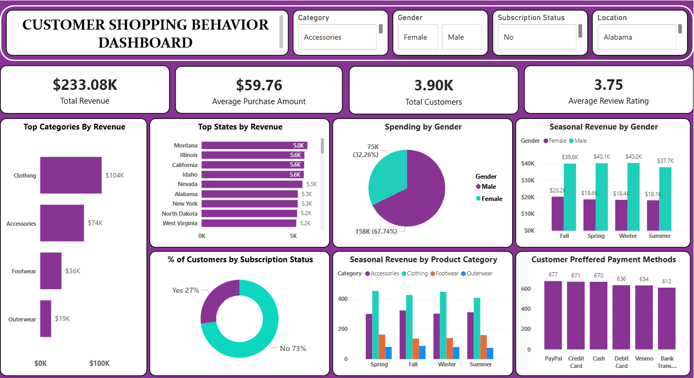
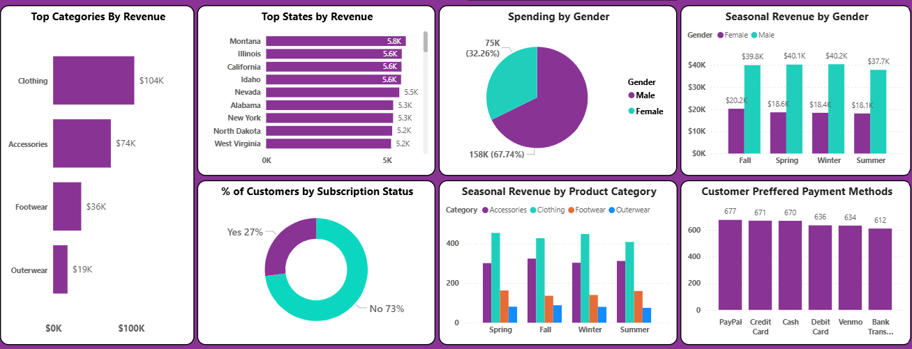
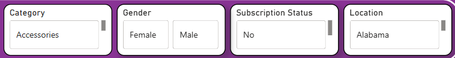

# Customer_Shopping_Behavior_Dashboard
End-to-end customer shopping behavior analysis using Python, SQL, and interactive dashboard visualization.

## Project Overview 
This project analyzes customer shopping behavior to uncover insights related to revenue trends, purchasing patterns, seasonal performance, and customer preferences. The analysis includes data cleaning, transformation, SQL-based business queries, and an interactive dashboard to visualize key performance indicators. The goal of this project is to demonstrate end-to-end data analytics skills including:
1. Data preprocessing
2. Feature engineering
3. SQL-based analysis
4. Business KPI extraction
5. Data visualization

## Objectives
1. Analyze total revenue and average purchase behavior
2. Identify top-performing product categories and states
3. Compare spending patterns by gender
4. Analyze seasonal revenue trends
5. Understand subscription impact on revenue
6. Identify preferred payment methods

## Tools & Technologies Used
1. Python (Pandas, NumPy) – Data cleaning & preprocessing
2. Jupyter Notebook – Data transformation & feature engineering
3. SQL – Business queries and revenue analysis
4. Data Visualization Tool (Power BI / Tableau / Matplotlib / etc.) – Dashboard creation
5. Git & GitHub – Version control and project hosting

## Methodology
1. Data Cleaning (Jupyter Notebook)
Removed null or inconsistent values
Standardized column names (reformatted with underscores _)
Corrected data types (dates, numerical columns)
Removed duplicates
Cleaned categorical values

3. Feature Engineering
Created Age Groups from age column
Generated new revenue-related metrics
Structured seasonal categorization
Formatted date fields for analysis

4. SQL Business Queries
Used SQL to extract insights such as:
Top 10 states by revenue
Top product categories by revenue
Revenue by gender
Seasonal revenue trends
Subscription vs non-subscription customer percentage
Payment method usage ranking
Average purchase amount
Revenue aggregation by multiple dimensions

5. KPI Calculation
Calculated and displayed:
Total Revenue
Average Purchase Amount
Total Customers
Average Review Rating

6. Dashboard Development
Created an interactive dashboard featuring:
Revenue breakdown by category
Top states by revenue
Spending by gender
Seasonal revenue by product category
Subscription distribution
Customer preferred payment methods
Dynamic filters (Category, Gender, Subscription Status, Location)

## Key Insights 
1. Clothing category generates the highest revenue
2. Male customers contribute a higher percentage of total spending
3. Majority of customers are non-subscribers
4. Revenue varies significantly across seasons
5. Digital payment methods dominate customer preferences

## Dashboard Preview
### Overall Dashboard

### KPI Section
 

### Charts & Distribution 

### Slicers
 

## Future Improvements
1. Add customer lifetime value (CLV) analysis
2. Build predictive sales forecasting model
3. Deploy dashboard to web
4. Automate ETL pipeline
5. Add real-time data integration

Author
Pranali Prakash Ranjane
Data Analyst | SQL | Python | Data Visualization
